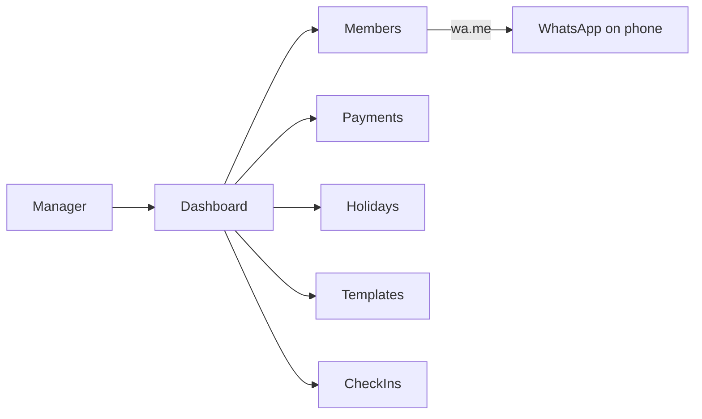

# Gym Management Website — Structure Plan

## Product decisions (locked)

- **Market:** Small/medium gyms in Morocco
- **Model:** One gym now; schema ready for multi-gym later (`gymId` on all records)
- **Membership:** Single plan only (monthly fee + duration set in gym settings)
- **WhatsApp:** Click-to-send via `wa.me` (prefilled message; manager taps Send)
- **Languages:** French + Arabic (UI + message templates); Arabic uses RTL
- **Auth (v1):** Simple manager login; optional staff role later

## Tech stack (default)

| Layer  | Choice                                                                           |
| ------ | -------------------------------------------------------------------------------- |
| App    | Next.js (App Router) + TypeScript                                                |
| UI     | Tailwind CSS; mobile-first (desk tablet/phone)                                   |
| DB     | SQLite via Prisma (easy local); switch to Postgres when selling                  |
| Auth   | NextAuth credentials (email/password or PIN for manager)                         |
| i18n   | `next-intl` (`fr` / `ar`)                                                        |
| Photos | Local uploads folder (or Cloudinary later)                                       |
| Export | SheetJS / CSV for Excel                                                          |
| Deploy | Vercel + file storage, or a cheap VPS if you prefer WhatsApp/desktop use on-site |

## Who uses it

- **Manager:** full access (members, renewals, holidays, templates, settings, export)
- **Staff (later):** check-in + view members only
- **Members:** no login in v1 (WhatsApp only)

## Core data model

- **Gym** — name, phone, address, monthlyPrice, membershipDays (e.g. 30), graceDays (e.g. 3), logo, defaultLocale
- **User** — manager (role), linked to `gymId`
- **Member** — firstName, lastName, phone (WhatsApp), cin, photoUrl, notes, status (`active` | `frozen` | `expired` | `cancelled`), freezeStart/freezeEnd
- **MembershipPeriod** — memberId, startDate, endDate, amountPaid, paidAt, note (history of renewals)
- **Holiday** — title, startDate, endDate, messageSentAt
- **MessageTemplate** — key (`welcome` | `payment_reminder` | `closure`), bodyFr, bodyAr, variables like `{{name}}`, `{{endDate}}`, `{{gymName}}`, `{{price}}`
- **CheckIn** — memberId, checkedInAt, createdBy
- **NotificationLog** (optional) — who was nudged, channel, when (so manager sees “already reminded today”)

Membership rule: **current end date** = latest active period’s `endDate`, adjusted if frozen (freeze pauses the clock by extending endDate when unfrozen).

## App pages / screens

1. **Login**
2. **Dashboard** — due soon (yellow), overdue (red), expiring in grace, today’s check-ins count, quick actions
3. **Members** — search by name / phone / CIN; filters by status
4. **Member detail** — profile, photo, payment history, renew, freeze, WhatsApp buttons
5. **Add / edit member** — form; on create → open WhatsApp welcome message
6. **Renewals queue** — list due/overdue; one-click renew + optional WhatsApp reminder
7. **Check-in** — search member → log visit; show if membership valid / overdue
8. **Holidays** — calendar list; “Notify all active members” opens WhatsApp one-by-one or copy-all helper
9. **Message templates** — edit FR/AR texts with variable chips
10. **Settings** — gym info, price, duration, grace days, language default
11. **Export** — download members + payments as Excel/CSV

## Key flows

### Add member (paid today)

1. Manager fills profile + marks paid
2. System creates `MembershipPeriod` (today → today + membershipDays)
3. Opens `wa.me/212…?text=…` with **welcome** template (gym hours, price, rules, end date)

### Payment due

1. Dashboard flags members where `endDate - today <= reminderWindow` or past due (after grace)
2. Manager clicks **Remind on WhatsApp** → payment reminder template
3. Manager clicks **Renew** → new period starts from previous end (or today if expired) + optional confirm WhatsApp

### Freeze

1. Set freeze start/end (or open-ended until unfreeze)
2. On unfreeze: extend `endDate` by frozen day count

### Holiday / closure

1. Create holiday range
2. **Notify members** → for each active member, open WhatsApp with closure template (manager sends; batch UX: “Next member” queue so it’s not 50 tabs at once)

### Check-in

1. Find member → if overdue past grace, warn in red but still allow check-in (manager decides)
2. Log `CheckIn`

## WhatsApp (click-to-send)

- Normalize Moroccan numbers to international (`0XXXXXXXXX` → `212XXXXXXXXX`)
- Build URL: `https://wa.me/{number}?text={urlencoded}`
- Templates support FR/AR; manager picks language per send, or use member’s preferred language field (default gym language)
- Never auto-send in v1; only deep links + a “copy message” fallback

## i18n / UX for Morocco

- Toggle FR | ع in header; persist preference
- RTL layout when `ar`
- Dates: `dd/MM/yyyy`; currency: MAD
- Phone-first UI: large tap targets for WhatsApp and Renew

## Sell-later readiness (without building multi-tenant UI yet)

- Every table has `gymId`
- Settings per gym
- Env/config selects the single gym for now
- Later: signup → create Gym + manager User

## Out of scope for v1

- Online card payments / Stripe
- Member self-service portal
- Class scheduling / bookings
- Fully automatic WhatsApp Business API
- Native mobile apps (responsive web is enough)

## Build order

1. Scaffold Next.js + Prisma schema + auth + i18n shell
2. Settings + message templates
3. Members CRUD + photo + welcome WhatsApp
4. Renew / due dashboard / grace / freeze
5. Check-in
6. Holidays + bulk notify queue
7. Excel export
8. Polish RTL, empty states, mobile layout

